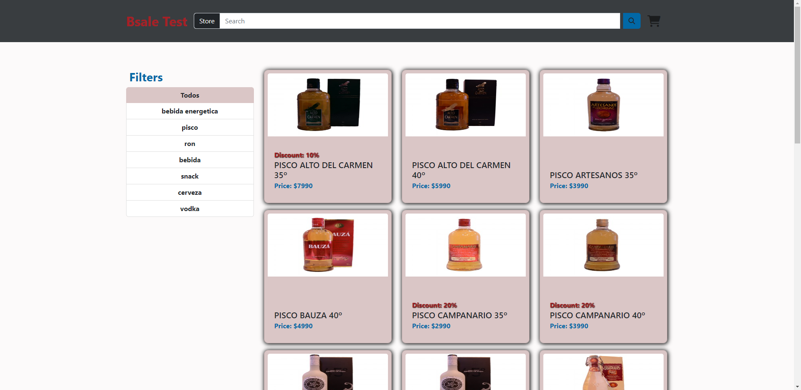
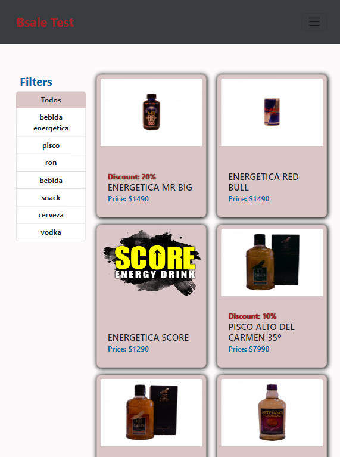
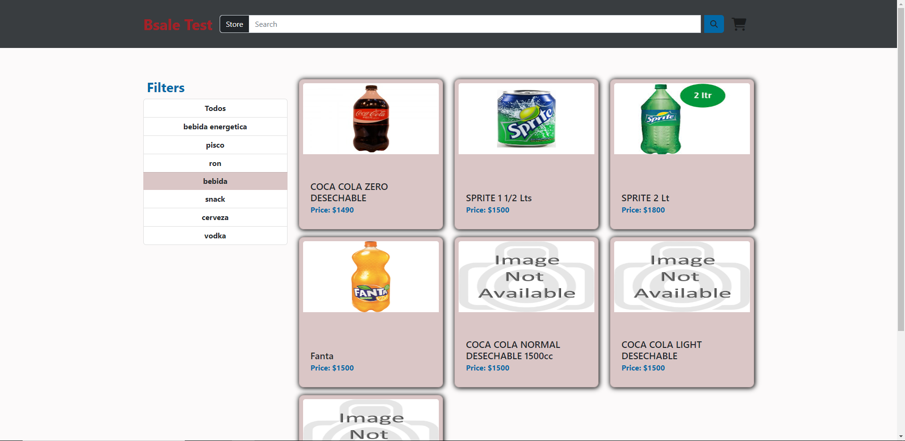
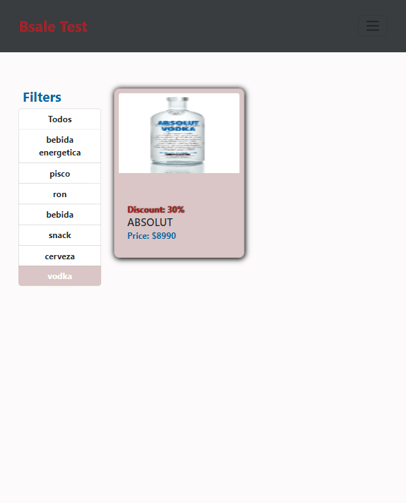
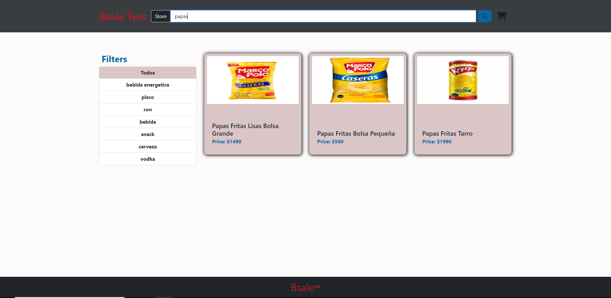
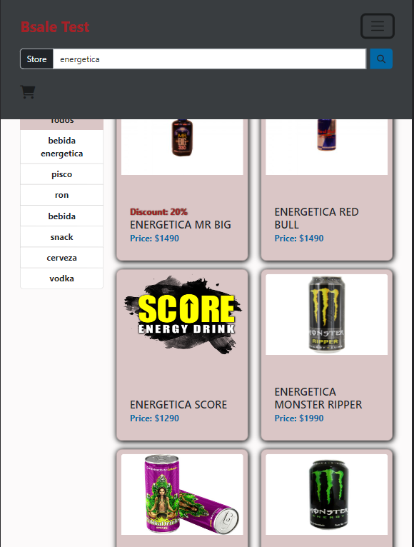
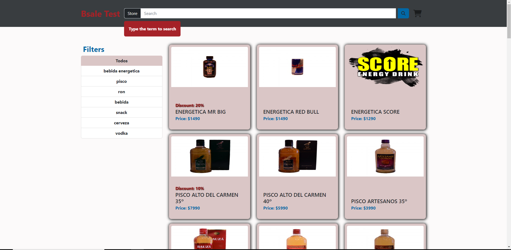
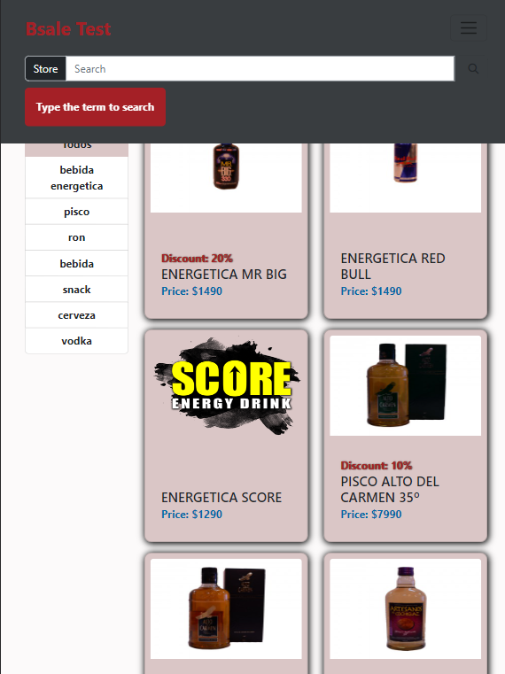

# Desafio bsale 
## Introduccion

Pagina realizada para compra de productos, el front end se realizo con vanilla js.
Se puede consultar productos por su nombre y arrojara coincidencias parecidas.
Se puede filtrar los productos por su categoria.

## Link del deploy
- Proyecto en [Netlify](https://wonderful-gecko-eea1f2.netlify.app/ "Proyecto en netlify")  
- Proyecto en [Github](https://github.com/luisangeluis/DesafioBsaleFront "Proyecto en github")

## Frameworks
- Bootstrap 5.2.2
- Font awesome 6.2.0

## Tecnologías
- Axios 1.1.2

## Documentación.
- VISTAS MOBILE Y DESKTOP

**VISTA DE TODOS LOS PRODUCTOS AL CARGAR LA PAGINA.**

**VISTA DE UNA CATEGORIA DE PRODUCTOS EN ESPECIFICO.**

**VISTA DE BUSQUEDA POR NOMBRE DE PRODUCTO, MUESTRA PRODUCTOS CON NOMBRES SIMILARES.**

**VISTA DE UNA ALERTA CUANDO INGRESAS EL TERMINO A BUSCAR.**

## Contribución

Puedes crear un pull request al proyecto.

## Licencia.

Licencia [MIT](https://opensource.org/licenses/MIT)

